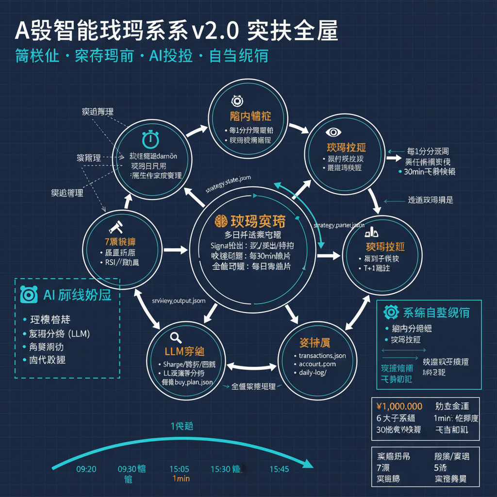

# 🤖 A股智能交易系统 v2.0

> **模块化 · 策略驱动 · AI辅助 · 自主运行**

AI 辅助的 A 股自动化模拟交易系统。初始资金 ¥1,000,000。系统自主运行，AI 负责环境搭建、LLM 复盘和策略调优。

## 📐 系统架构



## ✨ 核心特性

| 特性 | 说明 |
|------|------|
| 🧠 **独立策略模块** | 多因子决策引擎（大盘+新闻+技术+风控+市场状态），盘中快调 30min / 复盘全调 |
| 👁️ **1分钟盘中监控** | 实时行情 → 策略判断 → 自动执行，30分钟飞书快报 |
| 🤲 **纯净执行器** | 只买只卖不判断，原子文件锁防竞态，T+1 冻结 |
| 🔍 **LLM 深度复盘** | 系统健康检查 + Sharpe/胜率分析 + 买入计划生成 + 策略全面调整 |
| 🔭 **7源智能选股** | 涨幅榜/连涨/机构/板块/技术/AI基建/BaoStock + 多日跟踪 |
| ⏰ **统一调度器** | 替代 cron，交易日历自动判断，管理子进程生命周期 |
| 📊 **多日跟踪** | RSI / 动量 / 成交量趋势，跨交易日持续追踪候选股 |
| 💬 **飞书通知** | 30分钟快报 + 交易立即通知（可选） |

## 🚀 快速开始

### 方式一：让 AI 帮你运行（推荐）

> 用 GitHub Copilot 或其他 AI 助手打开此项目，说：
> **"帮我把这个交易系统运行起来"**

AI 会自动读取 `.github/copilot-instructions.md`，然后：
1. 安装 Python 依赖
2. 初始化账户（¥1,000,000）
3. 配置环境变量
4. 启动调度 daemon
5. 验证系统运行

### 方式二：手动设置

```bash
git clone https://github.com/cintia09/stock-trading-bot.git
cd stock-trading-bot
pip3 install -r requirements.txt
cp .env.example .env          # 编辑 .env（飞书和 LLM 可选）
python3 scripts/setup_account.py
python3 scripts/scheduler_daemon.py start -d   # 后台启动
python3 scripts/scheduler_daemon.py status      # 验证
```

## 🔄 每日运行周期

```
09:20  盘前情绪获取
       ↓
09:30  ┌─ monitor_v2 启动（1min循环）──────────────────────┐
       │  每1分钟: 行情→策略判断→执行交易                    │
       │  每30分钟: 飞书快报 + 策略快速调整(assess_intraday) │
       │  交易触发: 飞书立即通知                              │
11:30  │  ── 午休暂停 ──                                     │
13:00  │  ── 午后恢复 ──                                     │
15:00  └─────────────────────────────────────────────────────┘
       ↓
15:05  收盘报告
       ↓
15:30  LLM复盘 → 健康检查 → 策略全面调整 → 买入计划生成
       ↓
15:45  盘后选股 → 多日跟踪更新 → 7源筛选 → 候选股池
```

## 🧩 核心模块

| 模块 | 角色 | 文件 | 关键功能 |
|------|------|------|----------|
| 🧠 交易策略 | 大脑 | `trading_strategy.py` | `evaluate_position()` `evaluate_buy_candidate()` `assess_intraday()` `full_review_adjust()` |
| 👁️ 盘中监控 | 眼睛 | `monitor_v2.py` | 1min 循环 + 30min 飞书 + 策略快调 |
| 🤲 交易执行 | 双手 | `trade_executor.py` | `execute_buy()` `execute_sell()` 原子锁 |
| 🔍 LLM复盘 | 反思 | `llm_review_engine.py` | 健康检查 + LLM分析 + 买入计划 + 策略调整 |
| 🔭 选股系统 | 侦察 | `stock_discovery.py` | 7源筛选 + 质量评分 + 复盘/跟踪加成 |
| 📊 多日跟踪 | 记忆 | `multi_day_tracker.py` | RSI + 动量 + 成交量 + 连续出现天数 |
| ⏰ 调度器 | 心脏 | `scheduler_daemon.py` | 交易日历 + 任务调度 + 进程管理 |

### 数据流

```
选股 → discovered_stocks.json → 复盘从候选确定买入目标
                                    ↓
复盘 → buy_plan.json ──────────→ monitor_v2 读取并评估
     → review_output.json ─────→ 选股评分加成
     → strategy_params.json ───→ 策略参数更新
                                    ↓
monitor_v2 → 调用策略判断 → trade_executor 执行 → 飞书通知
```

## 🤖 AI 协作模式

本项目设计为 **"系统自主运行 + AI 离线辅助"** 模式：

| | ⚙️ 系统自主运行（实时） | 🤖 AI 离线辅助 |
|--|------------------------|---------------|
| **何时** | 交易时段 09:30-15:00 | 盘后 + 非交易时段 |
| **做什么** | 监控行情、策略判断、执行交易、飞书通知 | 环境搭建、LLM 复盘、参数调优、代码改进 |
| **依赖** | scheduler + monitor_v2 + strategy + executor | copilot-instructions + skills + memory |
| **介入方式** | 全自动，无需人工 | AI 读取指令文档后自动执行 |

### AI 文档

| 文件 | 用途 |
|------|------|
| `.github/copilot-instructions.md` | AI "工作手册"：架构说明、首次任务、日常维护 |
| `.github/copilot-memory.md` | AI "记忆"：系统状态、操作历史、积累洞察 |
| `.github/skills/setup-and-start.md` | 技能：环境搭建与系统启动 |
| `.github/skills/daily-review.md` | 技能：每日复盘与参数调优 |
| `.github/skills/system-maintenance.md` | 技能：系统维护与故障排除 |

## ⚙️ 配置

### 环境变量 (.env)

| 变量 | 必需 | 说明 |
|------|------|------|
| `FEISHU_APP_ID` | 否 | 飞书通知 |
| `FEISHU_APP_SECRET` | 否 | 飞书通知 |
| `LLM_PROVIDER` | 否 | LLM 提供商 (openclaw/openai/gemini) |
| `LLM_API_KEY` | 否 | LLM API Key |
| `LOG_LEVEL` | 否 | 日志级别 (默认 INFO) |
| `LOG_DIR` | 否 | 日志目录 (默认 /tmp) |

> 💡 不配置飞书和 LLM 也能运行，系统会跳过通知和 AI 辩论，使用规则引擎降级。

### Scheduler Daemon

```bash
python3 scripts/scheduler_daemon.py start -d   # 后台启动
python3 scripts/scheduler_daemon.py status      # 查看状态
python3 scripts/scheduler_daemon.py next        # 下一个任务
python3 scripts/scheduler_daemon.py stop        # 停止
python3 scripts/scheduler_daemon.py restart     # 重启
python3 scripts/scheduler_daemon.py install     # 安装为系统服务
```

## 📊 策略概要

| 维度 | 规则 |
|------|------|
| **选股** | 7源筛选 + 多因子评分 + 复盘/跟踪加成 |
| **决策** | 评分 ≥ 65 → LLM 多空辩论 → 信心分 ≥ 阈值 → Signal 买入 |
| **止损** | 硬止损 -3% + ATR 追踪止损 |
| **止盈** | +4% 减仓 50% → +8% 全部清仓 → ATR 追踪止盈 |
| **仓位** | 单只 ≤ 12%，总仓位 ≤ 50% |
| **快调** | 盘中每 30 分钟，无 LLM，< 1 秒 |
| **全调** | 复盘后全面调整，调用 LLM，更新 57 项参数 |

## 📜 License

MIT

